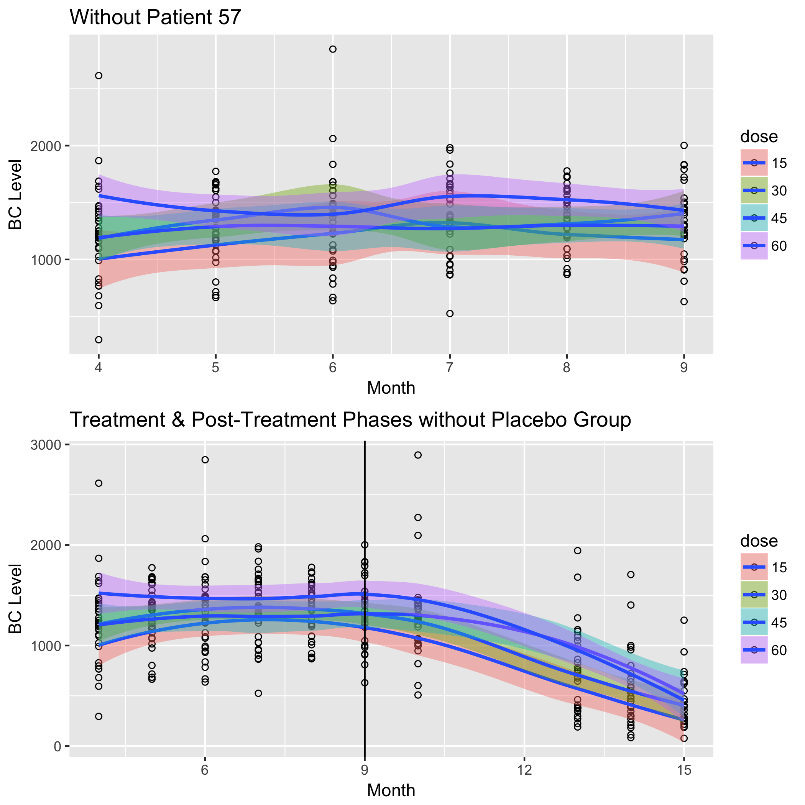

```{r setup, include=FALSE}
knitr::opts_chunk$set( echo = F, message = FALSE, warning = FALSE )
# --
# data visualization
library(ggplot2) 
library(GGally)
library(gridExtra)
library(knitr)
library(kableExtra)
# --
library(tidyverse) # data science package
library(MASS) # for glm.nb and other functions and datasets
library(survival) # survival analysis package
library(splines) # for ns function
library(gee) # generalized estimation equation solver
library(nlme) # for linear mixed effects models
library(MCMCpack)
library(rjags)
library(rmeta) # forestplots
# --
source("https://www.ics.uci.edu/~dgillen/STAT212/Handouts/Stat212Functions.R")
# --
# Extras
library(latex2exp) # math expressions in plots
library( mvtnorm ) # in order to use rmvnorm
```

```{r load data}
bc <- read.csv("https://www.ics.uci.edu/~dgillen/STAT212/Data/bcarotene_212final2018.csv", header = TRUE)
attach(bc)
```

# Abstract
Since previous studies have shown that the highly antioxidant beta-carotene (BC) is associated with a decreased risk of cancer, its pharmacokinetics needs to be better understood. In this study, we used generalized estimating equations (GEE) to confirmed these associations: BC supplementation impacts serum BC levels over time and it varies depending on dosage level, and, after BC supplementation is ceased, the rate at which patients return to baseline does not differ by dosage. It is estimated that the relative difference in mean serum BC comparing patients in the treatment group with patients in the placebo group throughout the 6 month treatment phase is $823.09$ ug/mL (95% CI: [598.18, 1048.00]). This estimate increases to $1055.52$ ug/mL (95% CI: [991.29, 1119.74]) after the potential outlier observations of patient 57 are removed. As secondary analyses, we explored the potential differences in effect of BC supplementation on serum BC levels over time by other covariates: gender, cholesterol, age, and body mass index (BMI). We also explored the effect of BC supplementation on serum vitamin E over time. Lastly, we created a predictive linear mixed effects model using Bayesian methods and provided some predictions for randomly chosen patients if they were to extend their duration of the BC supplementation. The biggest challenge with this study was that the data set was greatly unbalanced between those receiving treatment to those receiving placebo (4:1 ratio). These challenges may have affected our models and inferences made. 

# Introduction
Statistics in the 2012 American Cancer Society journal predicted that by year 2030, there will be 21.7 million new cancer cases and 13 million cancer deaths worldwide. When you adjust for other environmental or lifestyle factors like smoking, diabetes, pollution, or fewer childbirths, the numbers can seem very daunting. Studies like this one help us move toward a better understanding of cancer and what we can do to prevent it. Many antioxidants like BC have been used to prevent and battle against cancer. It has been shown that BC is associated with a decreased risk of cancer, but that some physiological factors can affect the absorption, storage, and utilization of the drug, which could then affect the impact it has against cancer. Our analysis seeks to confirm that BC supplementation does significantly impact the serum BC levels over time and that that impact is magnified by higher dosages. We explore the effect of other covariates on the impact of the supplementation, and we also explore the effect that BC supplementation has on serum vitamin E levels over time. We were able to confirm these associations, but, we were unable to create a good predictive model. However, through our association analyses, we made some interesting discoveries that is worth further investigation.

# Methods
These data were collected over the course of 15 months (double-blind) that was split into three phases, which we will call *pre-treatment*, *treatment*, and *post-treatment*. At the start of the study, these baseline measurements were collected from each patient: age, gender, BMI, and cholesterol (time-invariant covariates). On each monthly visit, plasma/serum BC (ug/mL) and plasma/serum vitamin E (ug/mL) were also collected from patients. From months 0 to 3, all patients were on placebo. 46 volunteers were randomized to receive one of five doses of BC (0, 15, 30, 45, or 60 mg/day) for a duration of 6 months (months 4 to 9). Then, after the ninth visit, all patients ceased supplementation and their levels were tracked for another 6 months. However, it is important to note that none of the 46 patients had data on months 11 and 12, and some patients had missing monthly observations. Another interesting note is that there seems to be some patients missing in the study as the patient id numbers extend to 57 even though there is only data for 46 patients. 

Our primary subset of data that we worked with was that during the treatment phase. We did some exploratory analysis in the pre-treatment phase just to get an understanding of our sample in terms of the distributions of serum BC, serum vitamin E, age, gender, BMI, and cholesterol. We also grabbed a baseline serum BC and serum vitamin E measurements by taking the average of those in the pre-treatment phase. This provided a better association model with more efficient estimates and confidence intervals. When investigating the rate at which patients returned to baseline after supplementation, we of course opened up our analysis to the data in post-treatment phase.

Patient 31 had missing serum BC and serum vitamin E levels for month 6. In order to utilize patient 31 in the analysis, that observation was filled in by the fitted value of a simple linear regression model based on the subject-specific trajectory during treatment phase. This seemed to be a reasonable decision instead of throwing away data. Patient 57 did not have missing information, but did seem like an abnormality. This patient's trajectory was clearly showing trends of someone taking BC supplement rather than a placebo. The deviation is blantantly noticeable. It is possible that Patient 57's dose was wrongly noted. Analysis with Patient 57 did not change the majority of our conclusions, but it did have a strong influence as briefly stated in the Abstract. For simplicity, our final models and inference will not include Patient 57.

The randomization of this study eliminates the need to adjust for other covariates besides dose, an indicator for treatment or placebo (predictor of interest), and serum BC (continuous response variable) for our primary scientific questions of interest. We chose to take a semi-parametric approach by fitting generalized estimating equations (GEE). Here we do not need to assume a full distribution on our continuous response variables, serum BC and serum vitamin E, and we could implement a covariance structure since we have inherently correlated data. Huber-White tells us that our regression estimates are consistent even if we misspecify the dependence model. GEE allowed us to gain efficiency in our estimators by assuming an exchangeable covariance structure based on our exploratory data analysis (EDA) in Appendix A. The appropriateness of the models were assessed using residual plots, and we used empirical correlation/covariance matrices and variograms for the EDA on our $\Sigma_i=Cov[Y_{i}]$, which can also be found in Appendix A. To safeguard our inference, we used the robust variance estimates. Implementation of the models was conducted using 'gee' package version 4.13-19 and RStudio version 1.1.414.

$Y_{ij}= \beta_0+\beta_1Tx_i+\beta_2mc.base_{i}+\beta_3month_{ij} + \beta_4Tx_i*month_{ij}+\epsilon_{ij}$ is the GEE model we used for the $i^{th}$ patient and $j^{th}$ measurement where $Y_{ij}$ is the plasma BC levels (ug/mL), $Tx_i$ is an indicator variable for whether or not a patient is on any dose treatment of BC supplementation besides the placebo. $mc.base_{i}$ is the mean-centered averages of plasma BC measurements from the pre-treatment phase. We mean-centered the covariate for better interpretability. $month_{ij}=1,2,..,n_i$ keeps track of the measurements during treatment phase, where $n_i$ is the number of treatment measurements for $i^{th}$ patient. Error terms are assumed independent and centered at zero with an independent covariance matrix.

To investigate whether the impact of BC supplementation on serum BC levels over time was dose-dependent, we focused on Treatment Phase and only those who received supplementation. Our mean model here was $E[Y_{ij}]=\beta_0+\beta_1(dose_i/15)+\beta_2mc.base_i+\beta_3t_{ij}+\beta_4t_{ij}(dose_i/15)$. Instead of an indicator variable for treatment, we tranformed dose by dividing by 15 for better interpretability. 


To build the predictive model, we used Bayesian Inference for linear mixed effects (LME) model. Here, we were able to place non-informative priors and through Gibbs sampling technique able to draw from the posterior distribution of the parameters. From there, we were able to obtain marginal estimates as well as subject-specific random intercepts and slopes. Our covariance matrix for our random effects was assumed to folow an inverse Wishart distribution. Here, we ignored vitamin E levels, BMI, and age based on our exploration of these covariates and their effect on the impact that supplementation had on serum BC levels. Here is our mean model: $$E[Y_{ij}|\vec{b_i}] = \beta_0 + \beta_{C1}Tx_i + \beta_{C2}Male_i + \beta_{C3}Chol_i + \beta_{C4}base_i + \beta_{L1}month_{ij} + \beta_{L2}Tx_i\cdot month_{ij}$$. Implementation of the model was conducted using 'rjags' package version 4-6.


# Results


If $\beta_1=0$ and $\beta_4=0$, the impact of supplementation on serum beta-carotene would be the same regardless of what type of treatment a patient receives. In other words, treatment has no effect on the relationship between supplementation on serum beta-carotene over time. 

Our models gives us strong evidence against these null hypotheses. 

$\widehat{\beta_1}=823.09$ is the estimated relative difference in mean serum beta-carotene comparing patients in treatment group with patients in placebo group at the start of the treatment phase ($t_{ij}=0$ i.e. end of month 3 (95% confidence interval using robust standard error: [598.18, 1048.00] ug/mL). 

$\widehat{\beta_4} + \widehat{\beta_3} = 17.89$ ug/mL is the estimated relative change in serum beta-carotene for every 1 month increase in time among patients who start the trial with similar baseline serum beta-carotene and receive supplementation (95% confidence interval using robust standard error: [-33.48, 69.25] ug/mL). 

There doesn't seem to be strong evidence to reject $H_0:\beta_3=0$. This is not too surprising since our EDA showed serum beta-carotene levels of placebo group patients to be constant through time. 

If we take $\beta_3=0$, then our previous estimate changes to $38.00$ ug/mL with 95% confidence interval [11.45, 64.56] ug/mL. 

There is evidence that beta-carotene supplementation impacts serum beta-carotene over time.  


Our inference does change without patient 57...

Our estimate for $\beta_1$ increases, which makes sense since patient 57 had similar behavior of serum beta-carotene as those in treatment groups even though they received placebo. 

$\widehat{\beta_1}=1055.52$ is the estimated relative difference in mean serum beta-carotene comparing patients in treatment group with patients in placebo group at the start of the treatment phase ($t_{ij}=0$ i.e. end of month 3 (95% confidence interval using robust standard error: [991.29, 1119.74] ug/mL). 

We also gain more precision in our trajectory estimates. 

$\widehat{\beta_4} + \widehat{\beta_3} = 18.00$ ug/mL is the estimated relative change in serum beta-carotene for every 1 month increase in time among patients who start the trial with similar baseline serum beta-carotene and receive supplementation (95% confidence interval using robust standard error: [4.46, 31.55] ug/mL). 

This time, our estimate for $\beta_3$ and its standard error, leads us to fail to reject $H_0:\beta_3=0$. In general, the EDA supports the null. The model states that the change in serum beta-carotene for every 1 month increase in time among patients who start the trial with similar baseline serum beta-carotene and receive placebo is 6.16 ug/mL (95% confidence interval [2.72, 9.61] ug/mL). This is a very small change in serum beta-carotene over time for the placebo group. We need to remember that our placebo sample only contains 9 patients compared with treatment group that contains 35 patients. So, we can't really trust our inference here in general.

When we eliminate patient 57, we have similar evidence that supports beta-carotene supplementation increases serum beta-carotene levels over time.

```{r table outputs}
table <- dget("output")
kable <- kable(table, format="latex", booktabs=T, align='c', 
               caption = "Table #: Output from GEE Model Comparing with and without Patient 57")
kable_styling(kable, latex_options = c("striped", "hold_position"), full_width = F)
```

The next question is if this impact is dose-dependent, is the impact of supplementation on serum beta-carotene over time different across dose levels.

If $\beta_1=0$ and $\beta_4=0$, then all patients would have the same model regardless of their dosage. 

$\widehat{\beta_1} + \widehat{\beta_4} = 122.46$ ug/mL is the estimated relative difference in the trajectory of serum beta-carotene comparing two subpopulations of patients who differ in dosage by 15 ug/mL with similar baseline serum beta-carotene (95% confidence interval using robust standard error: [54.23, 190.69] ug/mL). The higher the dosage that a patient receives, the larger their increase of serum beta-carotene over time. We have strong evidence to reject our null hypothesis. Our results support our observations from the previous EDA.


```{r mean plots, echo=FALSE, fig.cap="Mean Plots of BC Level Stratified by Dosage Level (mg/day)", out.width = '100%'}

```

```{r table dose outputs}
table <- dget("output2")
kable <- kable(table, format="latex", booktabs=T, align='c', 
               caption = "Table #: Output from GEE Dose-Dependent Model")
kable_styling(kable, latex_options = c("striped", "hold_position"), full_width = F)
```

```{r table post-dose outputs}
table <- dget("output3")
kable <- kable(table, format="latex", booktabs=T, align='c', 
               caption = "Table #: Output from GEE Dose-Dependent Model Post-Treatment")
kable_styling(kable, latex_options = c("striped", "hold_position"), full_width = F)
```

Based on our last figure, there does NOT seem to be a difference by dose in the rate at which patients return to baseline after ceasing supplementation. The trajectories seem to stay parallel with one another with highest dose above and lowest dose below.

To fit our model we need to focus on months 9 to 15 and again only those who receive supplementation. We can fit the same model to answer our scientific question.

Our EDA eluded to an autoregressive-1 working correlation structure. So, unlike previous models, we will fit the model using an AR-1 covariance structure. Our residuals plot shows slight funneling as fitted values increase, so we will again use our robust variance estimates. 

$\widehat{\beta_4} = 11.38$ ug/mL is the estimated relative difference in the decreasing trajectories of serum beta-carotene post-treatment comparing two subpopulations of patients who differed in dosage by 15 ug/mL during treatment and similar in baseline serum beta-carotene (95% confidence interval using robust standard error: [-23.31, 0.55] ug/mL). 

We have evidence to fail to reject our null hypothesis. Our results support our observations from the previous EDA. The trajectories in the decrease of serum beta-carotene seem parallel across dosage levels. 

If we take $\beta_4=0$, then the estimated serum beta-carotene post-treatment across dosage levels is $-153.37$ ug/mL for every one month increase for patients with similar baseline serum beta-carotene (95% confidence interval [-181.80, -124.94] ug/mL).


# Appendix A

```{r table of patient 31}
tablePatient31 <- dget("patient31")
colnames(tablePatient31) <- c("Obs.", "Patient ID", "Month", "BC", "Dosage", "Tx", "Baseline BC")
row.names(tablePatient31) <- NULL
kable <- kable(tablePatient31, format="latex", booktabs=T, align='c', 
               caption = "Table #: Patient 31 Missing Value Replaced with Average (968.4 ug/mL)")
kable_styling(kable, latex_options = c("striped", "hold_position"), full_width = F)
```

```{r patient 57, echo=FALSE, fig.cap="Histograms and Spaghetti Plots of Serum BC with and without Patient 57", out.width = '100%'}

```

```{r variogram, echo=FALSE, fig.cap="", out.width = '50%', out.height='50%'}

```

```{r variogram2, echo=FALSE, fig.cap="", out.width = '50%', out.height='50%'}

```

```{r pairs plot, echo=FALSE, fig.cap="Empirical Correlation Matrix during Treatment Phase", out.width = '50%', out.height='50%'}

```

```{r pairs plot2, echo=FALSE, fig.cap="Empirical Correlation Matrix during Post-Treatment Phase for Patients Having Received Treatment", out.width = '50%', out.height='50%'}

```

```{r pairs plot, echo=FALSE, fig.cap="Subject-Specific Random Effects", out.width = '50%', out.height='50%'}
knitr::include_graphics("randeffplot.jpg")
```

```{r res plot, echo=FALSE, fig.cap="Residual vs. Fitted Value Plots of Main Model", out.width = '50%', out.width='50%'}

```

```{r res plot2, echo=FALSE, fig.cap="Residual vs. Fitted Value Plots of Dose-Dependent Model", out.width = '50%', out.width='50%'}

```


# Appendix B


